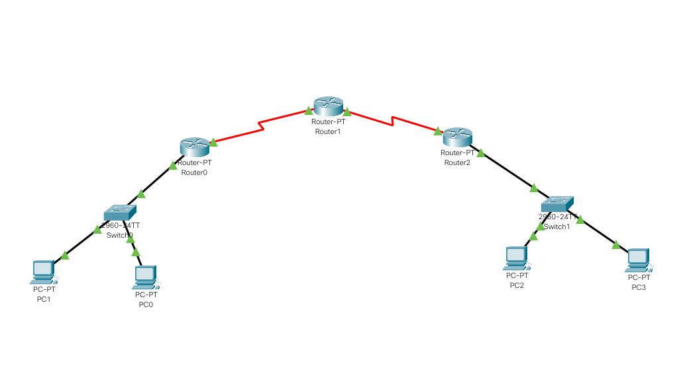

# Configuring default route to the Router

## Observations and learnings

- Creating a multiple router topology by connecting routersthrough serial ports and PC-router,Switch-router through fast ethernet.
- Assigning the ip addresses and default gateway to routers and PCs using the same method as in [Lab2](../Lab2)
- Assigning the static routes to router1 using the same method as in [Lab3](../Lab3)
- Assigning the default gateway routes to router0 and router2 using `ip route 0.0.0.0 0.0.0.0 <next hop>` in priviliged(`enable`)  configure (`configure terminal`) mode.
- Pinging from PC1 to PC3 and PC3 to PC1 now works as expected

### Topology

### IP Route for Router 0

### IP Route for Router 1

### IP Route for Router 2

### End to End ping

