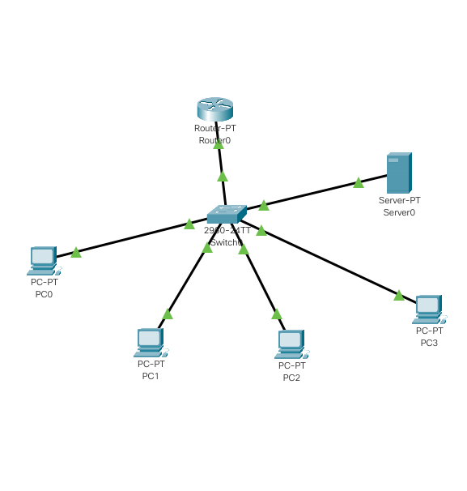
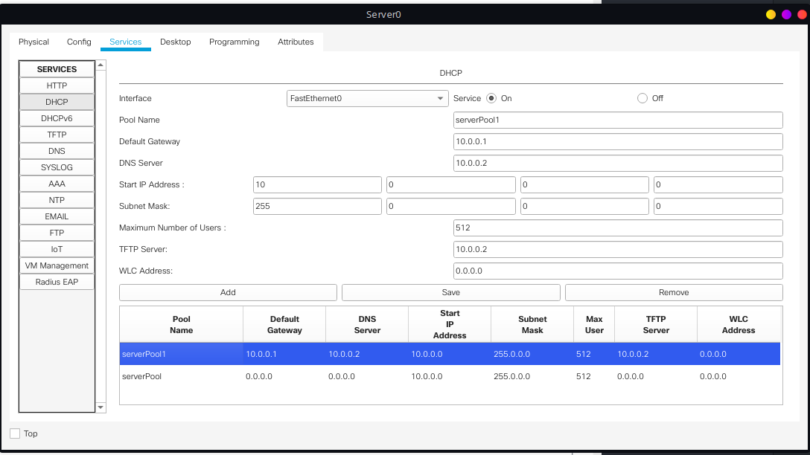
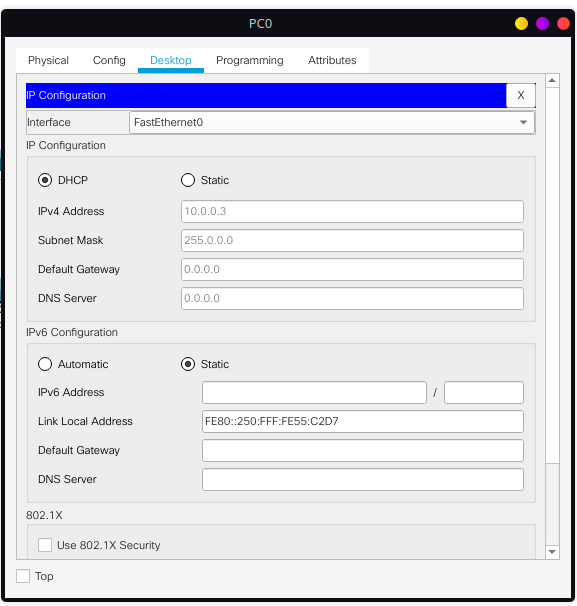

# Configuring DHCP within a LAN in a packet Tracer

## Observations and learnings

- Creating a multiple router topology by connecting router, DHCP server and PCs through fast ethernet.
- Assigning the ip addresses to router using the same method as in [Lab2](../Lab2)
- Assigning the default gateway to the server. 
- Setting up the DHCP services in ther server and filling the meta data like [serverdhcp](server.png)
- Assigning the ip address to the server with the same method as the router.
- Allowing the DHCP server to assign the PCs ip address by using the GUI(Services -> IP Configuration -> Select DHCP).

### Topology

### Server DHCP Config 

### PC ip address 

